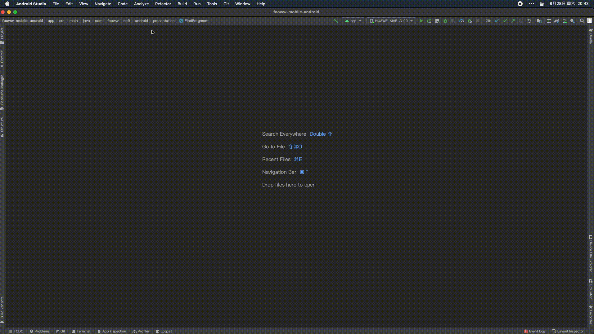

<h4 align="center"><strong>FindActivity</strong></h4>

Quickly jump to the corresponding Activity and Fragment of the current page

快速跳转到当前页面对应的 Activity 和 Fragment

  

<strong>HOW TO GET&nbsp;&nbsp;&nbsp;&nbsp;&nbsp;|&nbsp;&nbsp;&nbsp;&nbsp;&nbsp;如何获取&nbsp;&nbsp;&nbsp;&nbsp;</strong>

在 Android Studio 直接搜索 FindActivity 
在 JetBrain MarketPlace 搜索 FindActivity 
在 Github 上直接下载并拖拽到 Android Studio 中安装 

<strong>&nbsp;&nbsp;&nbsp;&nbsp;&nbsp;&nbsp;&nbsp;USAGE&nbsp;&nbsp;&nbsp;&nbsp;&nbsp;|&nbsp;&nbsp;&nbsp;&nbsp;&nbsp;使用方法</strong>

① Connect the mobile phone and open the corresponding app of the project on the mobile phone 
② Choose Menu -> Tools -> FindActivity to use or just use keyboard shortcut "Alt + 0"
  
① 连接手机并打开在手机上打开项目对应的app 
② 点击菜单栏 -> 工具 -> FindActivity 或者通过快捷键 "Alt + 0"
  

